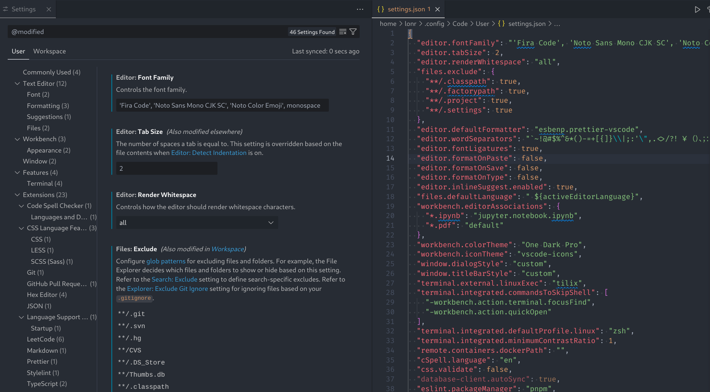

# Sort `settings.json`

Sorts the `settings.json` file according to the VSCode settings UI order.

1. Open `settings.json`
2. Open Command Palette(`Ctrl+Shift+P`), search and run `Sort settings.json`
3. Done! You can then save the file

## Known Issues

Some settings from Extensions are not sorted the same as the settings UI.

## Release Notes

### 1.0.0

Initial release of Sort `settings.json`

## For more information

Inspired by [Sort Package.json](https://github.com/keithamus/sort-package-json) and corresponding [VSCode extension](https://marketplace.visualstudio.com/items?itemName=unional.vscode-sort-package-json).

Thanks to [rich2005](https://www.gimp-forum.net/User-rich2005) for the [GIMP tutorial video](https://www.gimp-forum.net/Thread-Slicing-Filling-Image-Canvas-With-Other-Images-Diagonally?pid=18305#pid18305).
